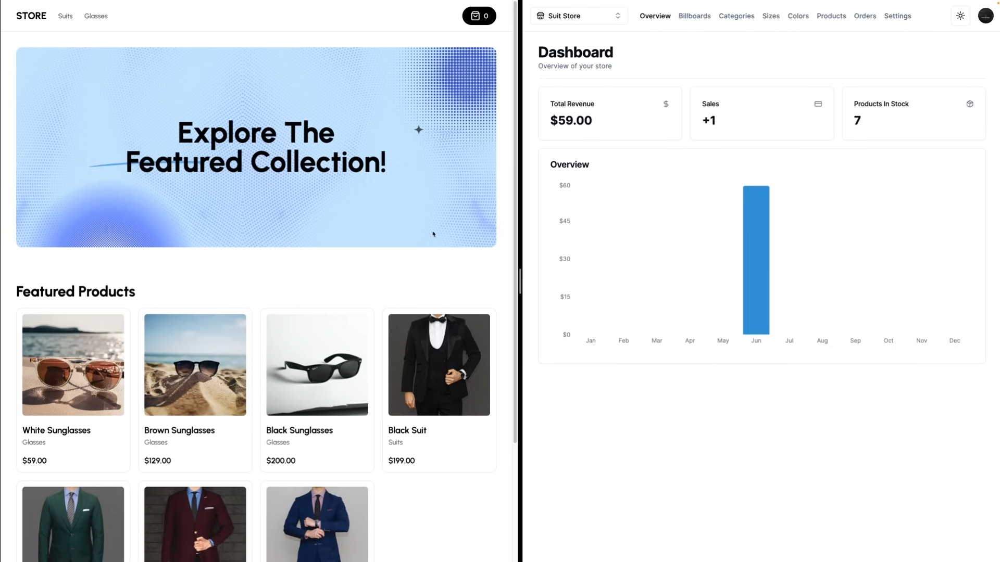

# The Next Shop

This is an e-commerce admin dashboard and headlessCMS build with Next.js 14. It is bootstrapped with `create next-app`.

- Dashboard (live demo) - https://the-next-shop-dashboard.vercel.app/
- Storefront (live demo) - https://the-next-shop-store.vercel.app/

## Dashboard: Tech Stack

- **Framework:** [Next.js](https://nextjs.org)
- **Styling:** [Tailwind CSS](https://tailwindcss.com)
- **Basic Authentication:** [Lucia](https://lucia-auth.com/)
- **Database:** [Neon Postgres](https://neon.tech/)
- **ORM:** [Drizzle ORM](https://orm.drizzle.team)
- **UI Components:** [shadcn/ui](https://ui.shadcn.com)
- **Image Uploads:** [Cloudinary](https://cloudinary.com/)
- **Payments infrastructure:** [Stripe](https://stripe.com)

## Storefront: Tech Stack

- **Framework:** [Next.js](https://nextjs.org)
- **Styling:** [Tailwind CSS](https://tailwindcss.com)
- **UI Components:** [HeadlessUI](https://headlessui.com/)
- **Payments infrastructure:** [Stripe](https://stripe.com)
